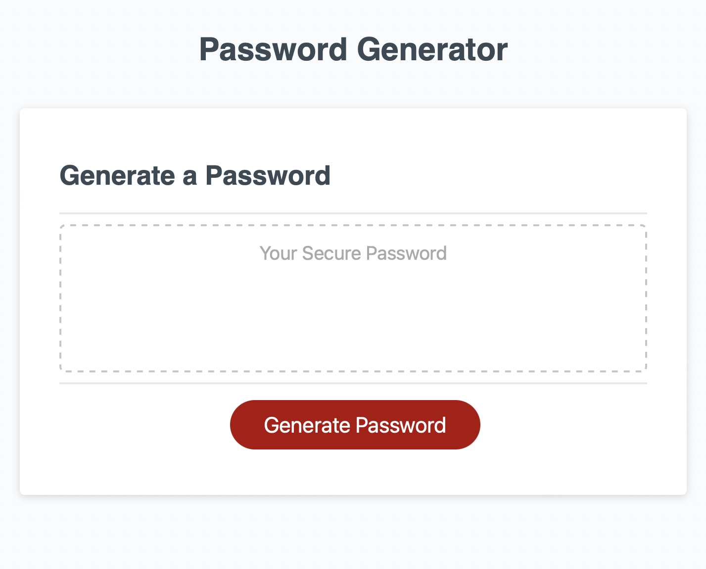

## JavaScript Password Generator

## **What**
A project using newly acquired JavaScript skills in onjects and functions to create a random password generator based on the following criteria:

- An app which runs in the browser and features dynamically updated HTML and CSS. all powered by JavaScript code that you will write
- A clean and polished user interface that is responsive, ensuring it adapts to multiple screen sizes

## **How**
The application needed to generate a random password upon clicking the 'generate password' button. 

This then triggers a series of questions asking the user to input their choices, including password length (between 10 and 64 characters) and character types (numeric, special characters, lower and upper case characters).

After the user answers all prompts, the password is randomly generated and displayed in the main text box ready for the user to copy and deploy.

## **Result**

The GitHub repository link:

https://github.com/Nikki1162/Password-Generator

The live application:

https://nikki1162.github.io/Password-Generator/

